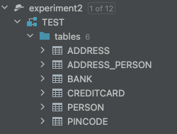
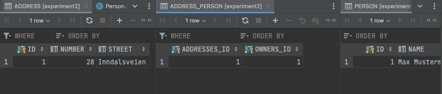

#DAT250: Software Technology Experiment Assignment 1

##Technical problems
The main issue I had was getting all the relationships between different tables to work correctly, and as can be seen 
from all the runs under [Actions](https://github.com/madsnesse/dat250-assignments/actions) It took a few tries to get it
working properly. 

The main issue was that I had forgotten to both do ```bank.setCreditcards()``` as well as 
```creditCard.setOwningBank()``` 
and hence I did  quite a lot of different changes to the annotations to try and fix the issue,
before I figured out it was just a small mistake  on setting correct ownership.

##Code 
The code to my project exists in the module that this file is located in i.e. [experiment-2](../experiment-2)

##Database
For database inspection I used the database plugin that comes preinstalled to Intellij, and the tables that was created 
was the ones seen here:

I was also able to open up all the tables and see that the correct data was entered providing a view like this:

which was really useful