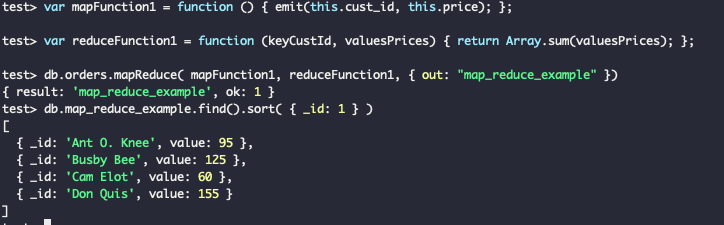

# DAT250: Software Technology Experiment Assignment 3

I have probably included too many images, but I had already spent some time inserting them when I read that I didnt need 
that many, hopefully I have given the 'collapses' good enough names that they are easy to understand

# Table of Contents
1. [Getting started](#getting-started-examples)
2. [Insert documents](#insert-documents)
3. [Query documents](#query-documents)
4. [Update documents](#update-documents)
5. [Bulk write](#bulk-write)
6. [Console output](#output)
## Installation
verifying checksum:


## Getting started examples:

#### Step 1:

<details><summary>switch database</summary>

</details>

#### Step 2:

<details><summary>populate database</summary>

</details>

#### Step 3:

<details><summary>find all</summary>

</details>

#### Step 4:

<details><summary>find where</summary>

</details>

#### Step 5:

<details><summary>find fields</summary>

</details>

## Insert documents


<details><summary>Insert and find one</summary>

</details>

<details><summary>Insert and find many</summary>

</details>

## Query documents

skipped parts of this since it was basically identical to previous one, but tried out some queries:

<details><summary>query</summary>

</details>
<details><summary>query find where a and b</summary>

</details>
<details><summary>query and, and or operation</summary>

</details>

## Update documents

<details><summary>update</summary>

</details>

## Delete documents

<details><summary>delete all</summary>

</details>
<details><summary>delete where condition</summary>

</details>

## Bulk write

<details><summary>Bulk write</summary>

</details>

## Output
<details><summary>
console output
</summary>

    test> db.inventory.insertOne()
    test> db.inventory.insertOne({item: "canvas", qty: 100, tags: ["cotton"], size:{h:28, w:35.5, uom: "cm"}})
    {
      acknowledged: true,
      insertedId: ObjectId("632ca5e9035b0ec9ff08513a")
    }
    test> db.inventory.find({item:"canvas"})
    [
      {
        _id: ObjectId("632ca5e9035b0ec9ff08513a"),
        item: 'canvas',
        qty: 100,
        tags: [ 'cotton' ],
        size: { h: 28, w: 35.5, uom: 'cm' }
      }
    ]
    test> db.inventory.insertMany([
    ...    { item: "journal", qty: 25, tags: ["blank", "red"], size: { h: 14, w: 21, uom: "cm" } },
    ...    { item: "mat", qty: 85, tags: ["gray"], size: { h: 27.9, w: 35.5, uom: "cm" } },
    ...    { item: "mousepad", qty: 25, tags: ["gel", "blue"], size: { h: 19, w: 22.85, uom: "cm" } }
    ... ])
    {
      acknowledged: true,
      insertedIds: {
        '0': ObjectId("632ca682035b0ec9ff08513b"),
        '1': ObjectId("632ca682035b0ec9ff08513c"),
        '2': ObjectId("632ca682035b0ec9ff08513d")
      }
    }
    test> dfb.inventory.find({})
    ReferenceError: dfb is not defined
    test> db.inventory.find({})
    [
      {
        _id: ObjectId("632ca5e9035b0ec9ff08513a"),
        item: 'canvas',
        qty: 100,
        tags: [ 'cotton' ],
        size: { h: 28, w: 35.5, uom: 'cm' }
      },
      {
        _id: ObjectId("632ca682035b0ec9ff08513b"),
        item: 'journal',
        qty: 25,
        tags: [ 'blank', 'red' ],
        size: { h: 14, w: 21, uom: 'cm' }
      },
      {
        _id: ObjectId("632ca682035b0ec9ff08513c"),
        item: 'mat',
        qty: 85,
        tags: [ 'gray' ],
        size: { h: 27.9, w: 35.5, uom: 'cm' }
      },
      {
        _id: ObjectId("632ca682035b0ec9ff08513d"),
        item: 'mousepad',
        qty: 25,
        tags: [ 'gel', 'blue' ],
        size: { h: 19, w: 22.85, uom: 'cm' }
      }
    ]
    test> [
    ...     { "item": "journal", "qty": 25, "size": { "h": 14, "w": 21, "uom": "cm" }, "status": "A" },
    ...     { "item": "notebook", "qty": 50, "size": { "h": 8.5, "w": 11, "uom": "in" }, "status": "A" },
    ...     { "item": "paper", "qty": 100, "size": { "h": 8.5, "w": 11, "uom": "in" }, "status": "D" },
    ...     { "item": "planner", "qty": 75, "size": { "h": 22.85, "w": 30, "uom": "cm" }, "status": "D" },
    ...     { "item": "postcard", "qty": 45, "size": { "h": 10, "w": 15.25, "uom": "cm" }, "status": "A" }
    ... ]
    [
      {
        item: 'journal',
        qty: 25,
        size: { h: 14, w: 21, uom: 'cm' },
        status: 'A'
      },
      {
        item: 'notebook',
        qty: 50,
        size: { h: 8.5, w: 11, uom: 'in' },
        status: 'A'
      },
      {
        item: 'paper',
        qty: 100,
        size: { h: 8.5, w: 11, uom: 'in' },
        status: 'D'
      },
      {
        item: 'planner',
        qty: 75,
        size: { h: 22.85, w: 30, uom: 'cm' },
        status: 'D'
      },
      {
        item: 'postcard',
        qty: 45,
        size: { h: 10, w: 15.25, uom: 'cm' },
        status: 'A'
      }
    ]
    test> test.inventory
    ReferenceError: test is not defined
    test> db.insertMany([)
    Uncaught:
    SyntaxError: Unexpected token (1:15)
    
    > 1 | db.insertMany([)
        |                ^
      2 |
    
    test> ...     { "item": "journal", "qty": 25, "size": { "h": 14, "w": 21, "uom": "cm" }, "status": "A" },
    Uncaught:
    SyntaxError: Unexpected token (1:0)
    
    > 1 | ...     { "item": "journal", "qty": 25, "size": { "h": 14, "w": 21, "uom": "cm" }, "status": "A" },
        | ^
      2 |
    
    test> ...     { "item": "notebook", "qty": 50, "size": { "h": 8.5, "w": 11, "uom": "in" }, "status": "A" },
    Uncaught:
    SyntaxError: Unexpected token (1:0)
    
    > 1 | ...     { "item": "notebook", "qty": 50, "size": { "h": 8.5, "w": 11, "uom": "in" }, "status": "A" },
        | ^
      2 |
    
    test> ...     { "item": "paper", "qty": 100, "size": { "h": 8.5, "w": 11, "uom": "in" }, "status": "D" },
    Uncaught:
    SyntaxError: Unexpected token (1:0)
    
    > 1 | ...     { "item": "paper", "qty": 100, "size": { "h": 8.5, "w": 11, "uom": "in" }, "status": "D" },
        | ^
      2 |
    
    test> ...     { "item": "planner", "qty": 75, "size": { "h": 22.85, "w": 30, "uom": "cm" }, "status": "D" },
    Uncaught:
    SyntaxError: Unexpected token (1:0)
    
    > 1 | ...     { "item": "planner", "qty": 75, "size": { "h": 22.85, "w": 30, "uom": "cm" }, "status": "D" },
        | ^
      2 |
    
    test> ...     { "item": "postcard", "qty": 45, "size": { "h": 10, "w": 15.25, "uom": "cm" }, "status": "A" }
    Uncaught:
    SyntaxError: Unexpected token (1:0)
    
    > 1 | ...     { "item": "postcard", "qty": 45, "size": { "h": 10, "w": 15.25, "uom": "cm" }, "status": "A" }
        | ^
      2 |
    
    test> db.insertMany([
    ... ...     { "item": "journal", "qty": 25, "size": { "h": 14, "w": 21, "uom": "cm" }, "status": "A" },
    ... ...     { "item": "notebook", "qty": 50, "size": { "h": 8.5, "w": 11, "uom": "in" }, "status": "A" },
    ... ...     { "item": "paper", "qty": 100, "size": { "h": 8.5, "w": 11, "uom": "in" }, "status": "D" },
    ... ...     { "item": "planner", "qty": 75, "size": { "h": 22.85, "w": 30, "uom": "cm" }, "status": "D" },
    ... ...     { "item": "postcard", "qty": 45, "size": { "h": 10, "w": 15.25, "uom": "cm" }, "status": "A" }
    ... ... ])
    Uncaught:
    SyntaxError: Unexpected token, expected "," (7:0)
    
      5 | ...     { "item": "planner", "qty": 75, "size": { "h": 22.85, "w": 30, "uom": "cm" }, "status": "D" },
      6 | ...     { "item": "postcard", "qty": 45, "size": { "h": 10, "w": 15.25, "uom": "cm" }, "status": "A" }
    > 7 | ... ])
        | ^
      8 |
    
    test> db.inventory.insertMany([
    ... ...     { "item": "journal", "qty": 25, "size": { "h": 14, "w": 21, "uom": "cm" }, "status": "A" },
    ... ...     { "item": "notebook", "qty": 50, "size": { "h": 8.5, "w": 11, "uom": "in" }, "status": "A" },
    ... ...     { "item": "paper", "qty": 100, "size": { "h": 8.5, "w": 11, "uom": "in" }, "status": "D" },
    ... ...     { "item": "planner", "qty": 75, "size": { "h": 22.85, "w": 30, "uom": "cm" }, "status": "D" },
    ... ...     { "item": "postcard", "qty": 45, "size": { "h": 10, "w": 15.25, "uom": "cm" }, "status": "A" }
    ... ... ])
    Uncaught:
    SyntaxError: Unexpected token, expected "," (7:0)
    
      5 | ...     { "item": "planner", "qty": 75, "size": { "h": 22.85, "w": 30, "uom": "cm" }, "status": "D" },
      6 | ...     { "item": "postcard", "qty": 45, "size": { "h": 10, "w": 15.25, "uom": "cm" }, "status": "A" }
    > 7 | ... ])
        | ^
      8 |
    
    test> db.insertMany([ ...     { "item": "journal", "qty": 25, "size": { "h": 14, "w": 21, "uom": "cm" }, "status": "A" }, ...     { "item": "notebook", "qty": 50, "size": { "h": 8.5, "w": 11, "uom": "in" }, "status": "A" }, ...     { "item": "paper", "qty": 100, "size": { "h": 8.5, "w": 11, "uom": "in" }, "status": "D" }, ...     { "item": "planner", "qty": 75, "size": { "h": 22.85, "w": 30, "uom": "cm" }, "status": "D" }, ...     { "item": "postcard", "qty": 45, "size": { "h": 10, "w": 15.25, "uom": "cm" }, "statu
    Uncaught:
    SyntaxError: Unterminated string constant. (1:508)
    
    > 1 | db.insertMany([ ...     { "item": "journal", "qty": 25, "size": { "h": 14, "w": 21, "uom": "cm" }, "status": "A" }, ...     { "item": "notebook", "qty": 50, "size": { "h": 8.5, "w": 11, "uom": "in" }, "status": "A" }, ...     { "item": "paper", "qty": 100, "size": { "h": 8.5, "w": 11, "uom": "in" }, "status": "D" }, ...     { "item": "planner", "qty": 75, "size": { "h": 22.85, "w": 30, "uom": "cm" }, "status": "D" }, ...     { "item": "postcard", "qty": 45, "size": { "h": 10, "w": 15.25, "uom": "cm" }, "statu
        |                                                                                                                                                                                                                                                                                                                                                                                                                                                                                                                             ^
      2 |
    
    test> db.inventory.insertMany([
    ...     { "item": "journal", "qty": 25, "size": { "h": 14, "w": 21, "uom": "cm" }, "status": "A" },
    ...     { "item": "notebook", "qty": 50, "size": { "h": 8.5, "w": 11, "uom": "in" }, "status": "A" },
    ...     { "item": "paper", "qty": 100, "size": { "h": 8.5, "w": 11, "uom": "in" }, "status": "D" },
    ...     { "item": "planner", "qty": 75, "size": { "h": 22.85, "w": 30, "uom": "cm" }, "status": "D" },
    ...     { "item": "postcard", "qty": 45, "size": { "h": 10, "w": 15.25, "uom": "cm" }, "status": "A" }
    ... ])
    {
      acknowledged: true,
      insertedIds: {
        '0': ObjectId("632ca8df035b0ec9ff08513e"),
        '1': ObjectId("632ca8df035b0ec9ff08513f"),
        '2': ObjectId("632ca8df035b0ec9ff085140"),
        '3': ObjectId("632ca8df035b0ec9ff085141"),
        '4': ObjectId("632ca8df035b0ec9ff085142")
      }
    }
    test> db.inventory.find({})
    [
      {
        _id: ObjectId("632ca5e9035b0ec9ff08513a"),
        item: 'canvas',
        qty: 100,
        tags: [ 'cotton' ],
        size: { h: 28, w: 35.5, uom: 'cm' }
      },
      {
        _id: ObjectId("632ca682035b0ec9ff08513b"),
        item: 'journal',
        qty: 25,
        tags: [ 'blank', 'red' ],
        size: { h: 14, w: 21, uom: 'cm' }
      },
      {
        _id: ObjectId("632ca682035b0ec9ff08513c"),
        item: 'mat',
        qty: 85,
        tags: [ 'gray' ],
        size: { h: 27.9, w: 35.5, uom: 'cm' }
      },
      {
        _id: ObjectId("632ca682035b0ec9ff08513d"),
        item: 'mousepad',
        qty: 25,
        tags: [ 'gel', 'blue' ],
        size: { h: 19, w: 22.85, uom: 'cm' }
      },
      {
        _id: ObjectId("632ca8df035b0ec9ff08513e"),
        item: 'journal',
        qty: 25,
        size: { h: 14, w: 21, uom: 'cm' },
        status: 'A'
      },
      {
        _id: ObjectId("632ca8df035b0ec9ff08513f"),
        item: 'notebook',
        qty: 50,
        size: { h: 8.5, w: 11, uom: 'in' },
        status: 'A'
      },
      {
        _id: ObjectId("632ca8df035b0ec9ff085140"),
        item: 'paper',
        qty: 100,
        size: { h: 8.5, w: 11, uom: 'in' },
        status: 'D'
      },
      {
        _id: ObjectId("632ca8df035b0ec9ff085141"),
        item: 'planner',
        qty: 75,
        size: { h: 22.85, w: 30, uom: 'cm' },
        status: 'D'
      },
      {
        _id: ObjectId("632ca8df035b0ec9ff085142"),
        item: 'postcard',
        qty: 45,
        size: { h: 10, w: 15.25, uom: 'cm' },
        status: 'A'
      }
    ]
    test> db.inventory.find({status: {$in: ["A","D"]}})
    [
      {
        _id: ObjectId("632ca8df035b0ec9ff08513e"),
        item: 'journal',
        qty: 25,
        size: { h: 14, w: 21, uom: 'cm' },
        status: 'A'
      },
      {
        _id: ObjectId("632ca8df035b0ec9ff08513f"),
        item: 'notebook',
        qty: 50,
        size: { h: 8.5, w: 11, uom: 'in' },
        status: 'A'
      },
      {
        _id: ObjectId("632ca8df035b0ec9ff085140"),
        item: 'paper',
        qty: 100,
        size: { h: 8.5, w: 11, uom: 'in' },
        status: 'D'
      },
      {
        _id: ObjectId("632ca8df035b0ec9ff085141"),
        item: 'planner',
        qty: 75,
        size: { h: 22.85, w: 30, uom: 'cm' },
        status: 'D'
      },
      {
        _id: ObjectId("632ca8df035b0ec9ff085142"),
        item: 'postcard',
        qty: 45,
        size: { h: 10, w: 15.25, uom: 'cm' },
        status: 'A'
      }
    ]
    test> db.inventory.find({status: "A", qty: {$lt:30}})
    [
      {
        _id: ObjectId("632ca8df035b0ec9ff08513e"),
        item: 'journal',
        qty: 25,
        size: { h: 14, w: 21, uom: 'cm' },
        status: 'A'
      }
    ]
    test> db.inventory.find({ status: "A", $or: [ { qty: { $lt: 30 } }, { item: /^p/ } ] })
    [
      {
        _id: ObjectId("632ca8df035b0ec9ff08513e"),
        item: 'journal',
        qty: 25,
        size: { h: 14, w: 21, uom: 'cm' },
        status: 'A'
      },
      {
        _id: ObjectId("632ca8df035b0ec9ff085142"),
        item: 'postcard',
        qty: 45,
        size: { h: 10, w: 15.25, uom: 'cm' },
        status: 'A'
      }
    ]
    test> db.inventory.insertMany( [
    ...    { item: "canvas", qty: 100, size: { h: 28, w: 35.5, uom: "cm" }, status: "A" },
    ...    { item: "journal", qty: 25, size: { h: 14, w: 21, uom: "cm" }, status: "A" },
    ...    { item: "mat", qty: 85, size: { h: 27.9, w: 35.5, uom: "cm" }, status: "A" },
    ...    { item: "mousepad", qty: 25, size: { h: 19, w: 22.85, uom: "cm" }, status: "P" },
    ...    { item: "notebook", qty: 50, size: { h: 8.5, w: 11, uom: "in" }, status: "P" },
    ...    { item: "paper", qty: 100, size: { h: 8.5, w: 11, uom: "in" }, status: "D" },
    ...    { item: "planner", qty: 75, size: { h: 22.85, w: 30, uom: "cm" }, status: "D" },
    ...    { item: "postcard", qty: 45, size: { h: 10, w: 15.25, uom: "cm" }, status: "A" },
    ...    { item: "sketchbook", qty: 80, size: { h: 14, w: 21, uom: "cm" }, status: "A" },
    ...    { item: "sketch pad", qty: 95, size: { h: 22.85, w: 30.5, uom: "cm" }, status: "A" }
    ... ] );
    {
      acknowledged: true,
      insertedIds: {
        '0': ObjectId("632caa8c035b0ec9ff085143"),
        '1': ObjectId("632caa8c035b0ec9ff085144"),
        '2': ObjectId("632caa8c035b0ec9ff085145"),
        '3': ObjectId("632caa8c035b0ec9ff085146"),
        '4': ObjectId("632caa8c035b0ec9ff085147"),
        '5': ObjectId("632caa8c035b0ec9ff085148"),
        '6': ObjectId("632caa8c035b0ec9ff085149"),
        '7': ObjectId("632caa8c035b0ec9ff08514a"),
        '8': ObjectId("632caa8c035b0ec9ff08514b"),
        '9': ObjectId("632caa8c035b0ec9ff08514c")
      }
    }
    test> db.inventory.updateOne(
    ...    { item: "paper" },
    ...    {
    ...      $set: { "size.uom": "cm", status: "P" },
    ...      $currentDate: { lastModified: true }
    ...    }
    ... )
    {
      acknowledged: true,
      insertedId: null,
      matchedCount: 1,
      modifiedCount: 1,
      upsertedCount: 0
    }
    test> db.inventory.updateMany(
    ...    { "qty": { $lt: 50 } },
    ...    {
    ...      $set: { "size.uom": "in", status: "P" },
    ...      $currentDate: { lastModified: true }
    ...    }
    ... )
    {
      acknowledged: true,
      insertedId: null,
      matchedCount: 7,
      modifiedCount: 7,
      upsertedCount: 0
    }
    test> db.inventory.replaceOne(
    ...    { item: "paper" },
    ...    { item: "paper", instock: [ { warehouse: "A", qty: 60 }, { warehouse: "B", qty: 40 } ] }
    ... )
    {
      acknowledged: true,
      insertedId: null,
      matchedCount: 1,
      modifiedCount: 1,
      upsertedCount: 0
    }
    test> db.inventory.deleteMany({})
    { acknowledged: true, deletedCount: 19 }
    test> db.inventory.findMany({})
    TypeError: db.inventory.findMany is not a function
    test> db.inventory.find({})
    
    test> db.inventory.insertMany( [
    ...    { item: "journal", qty: 25, size: { h: 14, w: 21, uom: "cm" }, status: "A" },
    ...    { item: "notebook", qty: 50, size: { h: 8.5, w: 11, uom: "in" }, status: "P" },
    ...    { item: "paper", qty: 100, size: { h: 8.5, w: 11, uom: "in" }, status: "D" },
    ...    { item: "planner", qty: 75, size: { h: 22.85, w: 30, uom: "cm" }, status: "D" },
    ...    { item: "postcard", qty: 45, size: { h: 10, w: 15.25, uom: "cm" }, status: "A" },
    ... ] );
    {
      acknowledged: true,
      insertedIds: {
        '0': ObjectId("632cab97035b0ec9ff08514d"),
        '1': ObjectId("632cab97035b0ec9ff08514e"),
        '2': ObjectId("632cab97035b0ec9ff08514f"),
        '3': ObjectId("632cab97035b0ec9ff085150"),
        '4': ObjectId("632cab97035b0ec9ff085151")
      }
    }
    test> db.inventory.deleteMany(){
    Uncaught:
    SyntaxError: Missing semicolon. (1:25)
    
    > 1 | db.inventory.deleteMany(){
        |                          ^
      2 |
    
    test> db.inventory.deleteMany({status:"A"})
    { acknowledged: true, deletedCount: 2 }
    test> db.inventory.find({})
    [
      {
        _id: ObjectId("632cab97035b0ec9ff08514e"),
        item: 'notebook',
        qty: 50,
        size: { h: 8.5, w: 11, uom: 'in' },
        status: 'P'
      },
      {
        _id: ObjectId("632cab97035b0ec9ff08514f"),
        item: 'paper',
        qty: 100,
        size: { h: 8.5, w: 11, uom: 'in' },
        status: 'D'
      },
      {
        _id: ObjectId("632cab97035b0ec9ff085150"),
        item: 'planner',
        qty: 75,
        size: { h: 22.85, w: 30, uom: 'cm' },
        status: 'D'
      }
    ]
    test> try {
    ...    db.pizzas.bulkWrite( [
    ...       { insertOne: { document: { _id: 3, type: "beef", size: "medium", price: 6 } } },
    ...       { insertOne: { document: { _id: 4, type: "sausage", size: "large", price: 10 } } },
    ...       { updateOne: {
    ...          filter: { type: "cheese" },
    ...          update: { $set: { price: 8 } }
    ...       } },
    ...       { deleteOne: { filter: { type: "pepperoni"} } },
    ...       { replaceOne: {
    ...          filter: { type: "vegan" },
    ...          replacement: { type: "tofu", size: "small", price: 4 }
    ...       } }
    ...    ] )
    ... } catch( error ) {
    ...    print( error )
    ... }
    {
      acknowledged: true,
      insertedCount: 2,
      insertedIds: { '0': 3, '1': 4 },
      matchedCount: 0,
      modifiedCount: 0,
      deletedCount: 0,
      upsertedCount: 0,
      upsertedIds: {}
    }
    test>

</details>

## Aggregation
<details>
<summary>map and reduce</summary>

</details>

I wrote a custom reduce function which instead of the sum of the prices for each customer id, takes the average
````javascript
var reduceFunction1 = function (keyCustId, valuesPrices) { 
    return Array.sum(valuesPrices)/valuesPrices.length; 
};
````
This is useful to obtain because it can be used to see how much each customer has spent on average
<details>
<summary>custom function</summary>

</details>

