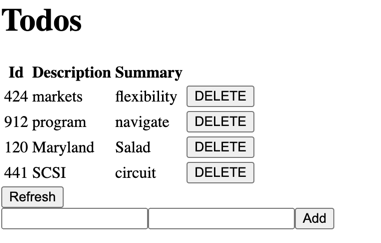
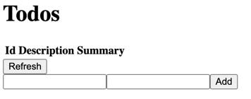
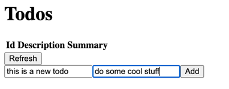
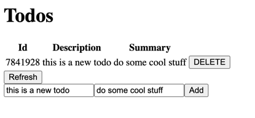
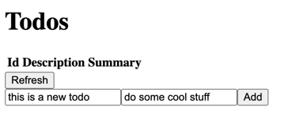

# DAT250: Software Technology Experiment Assignment 6

Didnt have time for experiment 3 so skipped that one as it was optional.

Didnt have any issues with experiment 1

Seeing as this was my first experience with angular, I had a lot of issues with getting things to work. Especially getting http requests with 'Observables' was a whole new experience. But once I had gotten the get all functionality in place the rest was no problem. Decided on just adding the files I had modified as I used angular to generate a bunch of initial files that would be a lot of clutter

## Demo
* Getting many Todos:

* No Active Todos: 

* Creating one Todo:

* Deleting the Todo:

